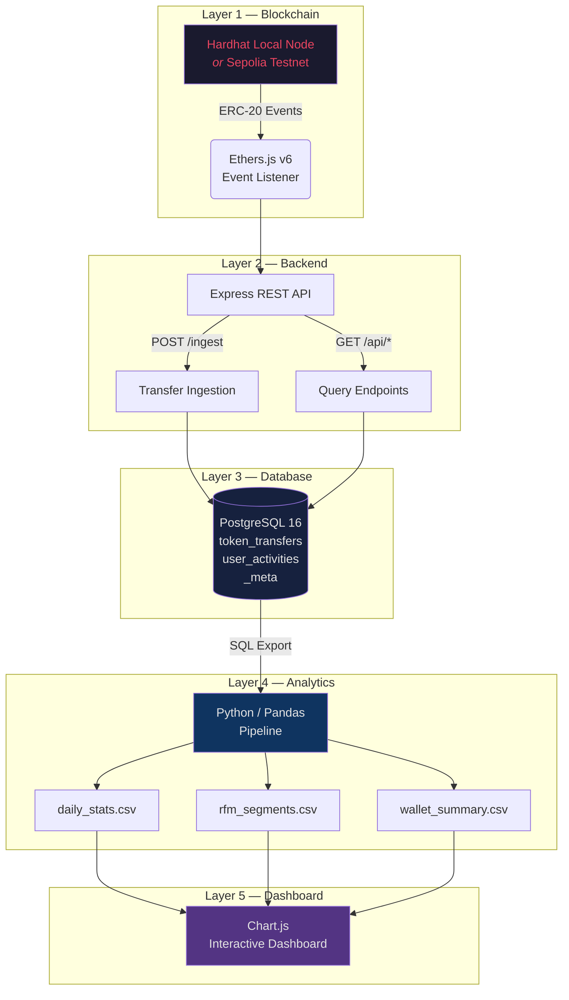

<p align="center">
  <h1 align="center">🔗 Web3 Analytics Dashboard</h1>
  <p align="center">
    <strong>A portfolio-grade, modular analytics platform for ERC-20 token tracking<br/>with hybrid blockchain support (Local Hardhat ↔ Live Sepolia Testnet)</strong>
  </p>
  <p align="center">
    
    
    
    
    
    
  </p>
</p>

---

## 📋 Table of Contents

- [Architecture Overview](#-architecture-overview)
- [Tech Stack](#-tech-stack)
- [Prerequisites](#-prerequisites)
- [Quick Start — Local Hardhat Mode](#-quick-start--local-hardhat-mode)
- [Quick Start — Sepolia Testnet Mode](#-quick-start--sepolia-testnet-mode)
- [Project Structure](#-project-structure)
- [Database Schema](#-database-schema)
- [Analytics Outputs](#-analytics-outputs)
- [API Endpoints](#-api-endpoints)
- [Troubleshooting](#-troubleshooting)
- [License](#-license)

---

## 🏗 Architecture Overview

The platform is composed of five distinct layers, each independently testable and deployable. Data flows from on-chain events through ingestion, storage, analysis, and finally visualization.



| Layer | Role |
|-------|------|
| **Blockchain** | Provides ERC-20 `Transfer` events — either from a local Hardhat node (development) or a live Sepolia testnet contract (hybrid mode). |
| **Backend** | Express server that listens for on-chain events via Ethers.js v6, ingests transfer data, and exposes REST endpoints for querying. |
| **Database** | PostgreSQL 16 stores all token transfers, user activity logs, and sync metadata with deduplication via UNIQUE constraints. |
| **Analytics** | Python/Pandas pipeline reads from the database, computes daily statistics, RFM segmentation, and wallet summaries over a dynamic 14-day rolling window. |
| **Dashboard** | Static HTML5/CSS3 frontend using Chart.js to render interactive charts — transfer volumes, daily active wallets, whale segmentation, and more. |

---

## 🛠 Tech Stack

| Component | Technology | Version |
|-----------|-----------|---------|
| Smart Contracts | Solidity | `0.8.24` |
| Blockchain Tooling | Hardhat | `2.22+` |
| Token Standard | OpenZeppelin Contracts | `v5.x` |
| Runtime | Node.js | `18+` |
| REST API | Express.js | `4.x` |
| Blockchain SDK | Ethers.js | `v6` |
| Database | PostgreSQL | `16` |
| Containerization | Docker & Docker Compose | `3.8` |
| Analytics Engine | Python / Pandas | `3.10+` |
| Visualization | Chart.js | `4.x` |
| Frontend | HTML5, CSS3, Vanilla JS | — |

---

## ✅ Prerequisites

Before you begin, ensure the following are installed:

| Requirement | Minimum Version | Check Command |
|-------------|----------------|---------------|
| **Node.js** | `18.0+` | `node --version` |
| **npm** | `9.0+` | `npm --version` |
| **Python** | `3.10+` | `python --version` |
| **pip** | latest | `pip --version` |
| **PostgreSQL** | `14+` (or Docker) | `psql --version` |
| **Git** | latest | `git --version` |

> **💡 Tip:** If you don't have PostgreSQL installed locally, you can use the included `docker-compose.yml` to spin up a containerized instance — no local install required.

---

## 🚀 Quick Start — Local Hardhat Mode

This mode deploys a test ERC-20 token to a local Hardhat node, seeds it with simulated transfers, and runs the full analytics pipeline. Perfect for development and portfolio demos.

### Step 1 — Clone & Navigate

```bash
git clone https://github.com/your-username/web3-analytics-dashboard.git
cd web3-analytics-dashboard
```

### Step 2 — Start PostgreSQL

**Option A: Docker (recommended)**

```bash
docker-compose up -d
```

**Option B: Local PostgreSQL**

```bash
# Ensure PostgreSQL is running, then create the database:
createdb web3_analytics
# Run the migration script:
psql -U postgres -d web3_analytics -f database/migrations/001_create_tables.sql
```

### Step 3 — Configure Environment

```bash
cp .env.example .env
# No changes needed for local mode — defaults work out of the box
```

### Step 4 — Deploy Smart Contracts

Open **two** terminal windows:

```bash
# Terminal 1 — Start local Hardhat node
cd blockchain
npm install
npx hardhat compile
npx hardhat node
```

```bash
# Terminal 2 — Deploy contracts & seed data
cd blockchain
npx hardhat run scripts/deploy.js --network localhost
npx hardhat run scripts/seed.js --network localhost
```

> The deploy script will automatically write the contract address to `blockchain/deployments/deployment.json` and the backend will pick it up.

### Step 5 — Start the Backend

```bash
cd backend
npm install
npm start
```

The server starts at `http://localhost:3000`. It will detect local mode (no `TRACKED_TOKEN_ADDRESS` in `.env`) and connect to the Hardhat node at `http://127.0.0.1:8545`.

### Step 6 — Run Analytics Pipeline

```bash
cd analytics
pip install -r requirements.txt
python process_data.py
```

Output CSV files are written to `analytics/output/`.

### Step 7 — Open the Dashboard

```bash
# Simply open in your browser:
open dashboard/index.html        # macOS
start dashboard/index.html       # Windows
xdg-open dashboard/index.html    # Linux
```

Or serve it via the backend at `http://localhost:3000` if static file serving is enabled.

---

## 🌐 Quick Start — Sepolia Testnet Mode

Hybrid mode connects to a **live ERC-20 token on Sepolia** — ideal for demonstrating real-world blockchain monitoring without deploying your own contract.

### Step 1 — Configure Environment

```bash
cp .env.example .env
```

Edit `.env` with your values:

```env
TRACKED_TOKEN_ADDRESS=0xYourSepoliaTokenAddress
SEPOLIA_RPC_URL=https://ethereum-sepolia-rpc.publicnode.com
```

> **🔑 Note:** You do **not** need a `DEPLOYER_PRIVATE_KEY` for read-only monitoring. The backend uses only public RPC calls to listen for `Transfer` events.

### Step 2 — Start PostgreSQL

```bash
docker-compose up -d
```

### Step 3 — Start the Backend

```bash
cd backend
npm install
npm start
```

The backend automatically detects that `TRACKED_TOKEN_ADDRESS` is set and enters **hybrid mode**:
- Connects to the Sepolia RPC endpoint
- Subscribes to `Transfer` events on the target contract
- Ingests live transfers into PostgreSQL in real time

### Step 4 — Run Analytics & Dashboard

```bash
# Analytics
cd analytics && python process_data.py

# Dashboard
open dashboard/index.html
```

---

## 📂 Project Structure

```
web3-analytics-dashboard/
│
├── .env.example                 # Environment variable template
├── .gitignore                   # Git ignore rules
├── docker-compose.yml           # PostgreSQL container configuration
├── README.md                    # This file
│
├── blockchain/                  # Layer 1 — Smart Contracts
│   ├── contracts/
│   │   └── AnalyticsToken.sol   # ERC-20 token contract (OpenZeppelin v5)
│   ├── scripts/
│   │   ├── deploy.js            # Deployment script (local + Sepolia)
│   │   └── seed.js              # Generate simulated transfers
│   ├── test/
│   │   └── AnalyticsToken.test.js
│   ├── deployments/
│   │   └── deployment.json      # Auto-generated contract addresses
│   ├── hardhat.config.js        # Hardhat configuration
│   └── package.json
│
├── backend/                     # Layer 2 — REST API & Event Listener
│   ├── src/
│   │   ├── server.js            # Express app entry point
│   │   ├── config.js            # Environment & mode detection
│   │   ├── db.js                # PostgreSQL connection pool
│   │   ├── listener.js          # Ethers.js event listener
│   │   └── routes/
│   │       └── api.js           # REST endpoint definitions
│   └── package.json
│
├── database/                    # Layer 3 — Schema & Migrations
│   └── migrations/
│       └── 001_create_tables.sql # Table definitions & indexes
│
├── analytics/                   # Layer 4 — Python Data Pipeline
│   ├── process_data.py          # Main analytics pipeline
│   ├── requirements.txt         # Python dependencies
│   └── output/                  # Generated CSV files
│       ├── daily_stats.csv
│       ├── rfm_segments.csv
│       └── wallet_summary.csv
│
└── dashboard/                   # Layer 5 — Visualization
    ├── index.html               # Main dashboard page
    ├── css/
    │   └── styles.css           # Dashboard styling
    └── js/
        └── main.js              # Chart.js rendering logic
```

---

## 🗄 Database Schema

The database uses three tables, managed via the migration file at `database/migrations/001_create_tables.sql`.

### `token_transfers`

Stores every ERC-20 `Transfer` event captured from the blockchain.

| Column | Type | Description |
|--------|------|-------------|
| `id` | `SERIAL PRIMARY KEY` | Auto-incrementing row ID |
| `tx_hash` | `VARCHAR(66) NOT NULL` | Transaction hash |
| `log_index` | `INTEGER NOT NULL` | Log index within the transaction |
| `block_number` | `BIGINT NOT NULL` | Block in which the transfer occurred |
| `from_address` | `VARCHAR(42) NOT NULL` | Sender wallet address |
| `to_address` | `VARCHAR(42) NOT NULL` | Recipient wallet address |
| `value` | `NUMERIC NOT NULL` | Raw transfer amount (wei) |
| `timestamp` | `TIMESTAMPTZ NOT NULL` | Block timestamp |

**Constraints:**
- `UNIQUE(tx_hash, log_index)` — prevents duplicate ingestion of the same event, enabling safe re-indexing and idempotent backfills.

### `user_activities`

Tracks aggregated wallet activity metrics for analytics.

| Column | Type | Description |
|--------|------|-------------|
| `id` | `SERIAL PRIMARY KEY` | Auto-incrementing row ID |
| `wallet_address` | `VARCHAR(42) NOT NULL` | Wallet address |
| `activity_type` | `VARCHAR(20) NOT NULL` | `'send'` or `'receive'` |
| `tx_count` | `INTEGER DEFAULT 0` | Number of transactions |
| `total_value` | `NUMERIC DEFAULT 0` | Total value transferred |
| `last_active` | `TIMESTAMPTZ` | Most recent activity timestamp |

**Constraints:**
- `UNIQUE(wallet_address, activity_type)` — one row per wallet per direction, updated via upserts.

### `_meta`

Internal metadata table for tracking sync state.

| Column | Type | Description |
|--------|------|-------------|
| `key` | `VARCHAR(64) PRIMARY KEY` | Metadata key (e.g., `'last_synced_block'`) |
| `value` | `TEXT` | Metadata value |

---

## 📊 Analytics Outputs

The Python analytics pipeline (`analytics/process_data.py`) reads from PostgreSQL and generates three CSV files in `analytics/output/`. All computations use a **dynamic 14-day rolling window** — only transfers from the last 14 days are included, ensuring metrics reflect recent on-chain activity.

### `daily_stats.csv`

Daily aggregate metrics for the token.

| Column | Description |
|--------|-------------|
| `date` | Calendar date |
| `transfer_count` | Number of transfers that day |
| `unique_senders` | Distinct sender wallets |
| `unique_receivers` | Distinct receiver wallets |
| `total_volume` | Sum of all transfer values (formatted) |
| `avg_transfer` | Average transfer size |

### `rfm_segments.csv`

RFM (Recency, Frequency, Monetary) segmentation for each wallet.

| Column | Description |
|--------|-------------|
| `wallet_address` | Wallet address |
| `recency_days` | Days since last transfer |
| `frequency` | Total number of transfers |
| `monetary` | Total value transferred |
| `rfm_score` | Composite RFM score (1–5 scale) |
| `segment` | Label: `whale`, `active`, `casual`, `dormant`, `new` |

### `wallet_summary.csv`

Per-wallet summary statistics.

| Column | Description |
|--------|-------------|
| `wallet_address` | Wallet address |
| `total_sent` | Total value sent |
| `total_received` | Total value received |
| `net_flow` | `total_received - total_sent` |
| `tx_count` | Total transactions (send + receive) |
| `first_seen` | Timestamp of earliest activity |
| `last_seen` | Timestamp of most recent activity |

---

## 🔌 API Endpoints

The Express backend exposes the following REST endpoints:

### Health Check

```
GET /health
```

Returns server status and current operating mode.

```json
{
  "status": "healthy",
  "mode": "local",
  "uptime": 12345,
  "timestamp": "2026-05-23T03:38:00.000Z"
}
```

### List Transfers

```
GET /api/transfers?limit=50&offset=0
```

Returns paginated token transfer records, newest first.

| Parameter | Type | Default | Description |
|-----------|------|---------|-------------|
| `limit` | `int` | `50` | Max rows to return (max 1000) |
| `offset` | `int` | `0` | Pagination offset |

### List User Activities

```
GET /api/activities?wallet=0x...
```

Returns aggregated activity for all wallets, or a specific wallet if filtered.

| Parameter | Type | Default | Description |
|-----------|------|---------|-------------|
| `wallet` | `string` | — | Optional wallet address filter |

### Aggregate Statistics

```
GET /api/stats
```

Returns summary statistics for the dashboard.

```json
{
  "totalTransfers": 1247,
  "uniqueWallets": 89,
  "totalVolume": "15000000000000000000000",
  "last24hTransfers": 42
}
```

### Ingest Transfer (Internal)

```
POST /ingest
Content-Type: application/json
```

Used internally by the event listener to write captured transfers to the database. Not intended for external use.

```json
{
  "txHash": "0x...",
  "logIndex": 0,
  "blockNumber": 12345,
  "from": "0x...",
  "to": "0x...",
  "value": "1000000000000000000",
  "timestamp": 1716422280
}
```

---

## 🔧 Troubleshooting

### RPC Rate Limits

**Symptom:** `Error: 429 Too Many Requests` when connecting to Sepolia.

**Solution:**
- The default public RPC (`publicnode.com`) has rate limits. For heavy usage, switch to a dedicated provider:
  ```env
  SEPOLIA_RPC_URL=https://eth-sepolia.g.alchemy.com/v2/YOUR_KEY
  ```
- Alternatively, use [Infura](https://infura.io) or [QuickNode](https://quicknode.com) free tiers.

### Database Connection Errors

**Symptom:** `Error: connect ECONNREFUSED 127.0.0.1:5432`

**Solution:**
1. Ensure PostgreSQL is running:
   ```bash
   docker-compose ps    # Check container status
   docker-compose up -d # Restart if needed
   ```
2. Verify credentials in `.env` match the Docker Compose configuration.
3. If using local PostgreSQL, ensure the `web3_analytics` database exists:
   ```bash
   psql -U postgres -c "SELECT 1 FROM pg_database WHERE datname = 'web3_analytics';"
   ```

### Hardhat Node Issues

**Symptom:** `Error: could not detect network` or contract deployment fails.

**Solution:**
1. Ensure the Hardhat node is running in a separate terminal:
   ```bash
   cd blockchain && npx hardhat node
   ```
2. The node must be running **before** deploying contracts or starting the backend in local mode.
3. If the node was restarted, you must re-deploy contracts — Hardhat node state is ephemeral:
   ```bash
   npx hardhat run scripts/deploy.js --network localhost
   npx hardhat run scripts/seed.js --network localhost
   ```

### Analytics Pipeline Errors

**Symptom:** `process_data.py` fails with empty DataFrames or connection errors.

**Solution:**
1. Ensure the database has data — run seed scripts first or wait for Sepolia events.
2. Check that `DB_*` variables in `.env` are correct.
3. Install dependencies: `pip install -r analytics/requirements.txt`

### Dashboard Shows No Data

**Symptom:** Charts are empty or show "No data available."

**Solution:**
1. Run the analytics pipeline first — the dashboard reads from CSV files.
2. If using the API-backed dashboard, ensure the backend is running at `http://localhost:3000`.
3. Check browser console (F12) for CORS or fetch errors.

---

## 📄 License

This project is licensed under the **MIT License**.

```
MIT License

Copyright (c) 2026 Web3 Analytics Dashboard

Permission is hereby granted, free of charge, to any person obtaining a copy
of this software and associated documentation files (the "Software"), to deal
in the Software without restriction, including without limitation the rights
to use, copy, modify, merge, publish, distribute, sublicense, and/or sell
copies of the Software, and to permit persons to whom the Software is
furnished to do so, subject to the following conditions:

The above copyright notice and this permission notice shall be included in all
copies or substantial portions of the Software.

THE SOFTWARE IS PROVIDED "AS IS", WITHOUT WARRANTY OF ANY KIND, EXPRESS OR
IMPLIED, INCLUDING BUT NOT LIMITED TO THE WARRANTIES OF MERCHANTABILITY,
FITNESS FOR A PARTICULAR PURPOSE AND NONINFRINGEMENT. IN NO EVENT SHALL THE
AUTHORS OR COPYRIGHT HOLDERS BE LIABLE FOR ANY CLAIM, DAMAGES OR OTHER
LIABILITY, WHETHER IN AN ACTION OF CONTRACT, TORT OR OTHERWISE, ARISING FROM,
OUT OF OR IN CONNECTION WITH THE SOFTWARE OR THE USE OR OTHER DEALINGS IN THE
SOFTWARE.
```

---

<p align="center">
  Built with ❤️ for the Web3 community
</p>
